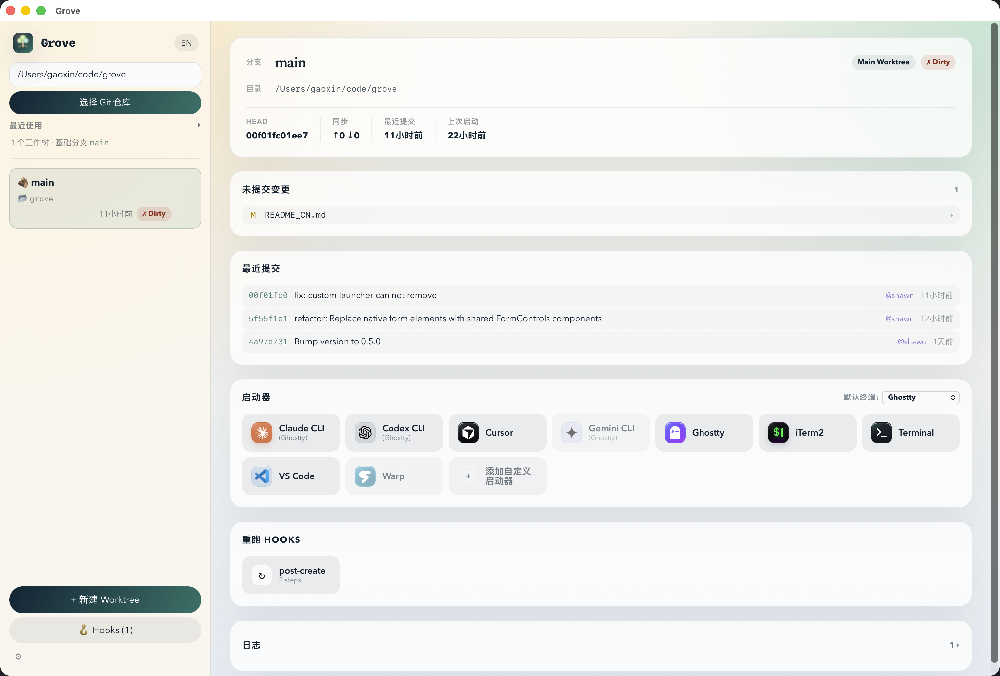

# Grove

一个管理 Git Worktree 的 GUI 应用，帮你

- 快速从 Worktree 目录启动 VsCode / Ghostty 等应用，或者自己定义启动器
- 自定义 WorkTree Hooks，快速完成新建 Worktree 之后的依赖安装、配置文件复制等功能

## 界面



## 功能

### Worktree

- **工作树扫描** — 使用 `git worktree list --porcelain` 解析所有工作树，显示 dirty / ahead / behind / prunable / locked 状态
- **创建工作树** — 支持新分支、已有本地分支、远程分支三种模式，分支下拉选择，自动生成随机分支名，自动填充目标路径
- **删除工作树** — 流式执行日志，支持预览和执行 `git worktree prune`
- **一键启动** — 支持 Terminal、Ghostty、iTerm2、VS Code、Cursor、Claude CLI、Codex CLI、Gemini CLI

### Hooks

支持 6 个生命周期钩子事件，在工作树的创建、启动、删除各阶段自动执行自定义操作：

| 事件          | 触发时机         | 工作目录   |
| ------------- | ---------------- | ---------- |
| `pre-create`  | 工作树创建**前** | 仓库根目录 |
| `post-create` | 工作树创建**后** | 工作树目录 |
| `pre-launch`  | 启动器执行**前** | 工作树目录 |
| `post-launch` | 启动器执行**后** | 工作树目录 |
| `pre-remove`  | 工作树删除**前** | 工作树目录 |
| `post-remove` | 工作树删除**后** | 仓库根目录 |

每个钩子由一个或多个**步骤**组成，支持 4 种步骤类型：

> 其实本质是 script 和 launch 两种，只是为了方便

#### `script` — 执行任意 Shell 命令

```toml
[[hooks.post-create]]
type = "script"
run = "echo 'Worktree {branch} ready at {worktree_path}'"
```

#### `install` — 自动检测包管理器并安装依赖

不指定 `run` 时自动检测：pnpm → bun → yarn → npm、poetry → pdm → pipenv → uv → pip、bundle、cargo build、go mod download、composer、dotnet restore、gradlew、mvn 等。也可手动指定命令。

```toml
[[hooks.post-create]]
type = "install"

# 或手动指定
[[hooks.post-create]]
type = "install"
run = "pip install -r requirements.txt"
```

#### `copy-files` — 从仓库根目录复制文件到新工作树

适合复制 `.env.local` 等不受版本控制的配置文件。目标已存在则跳过。

```toml
[[hooks.post-create]]
type = "copy-files"
paths = [".env.local", ".npmrc", ".env.production"]
```

#### `launch` — 在钩子中触发一个启动器

```toml
[[hooks.post-create]]
type = "launch"
launcherId = "vscode"
```

#### 模板变量（TODO）

在 `run` 字段中可使用 `{variable}` 语法引用上下文变量：

| 变量                 | 说明            | 示例                                  |
| -------------------- | --------------- | ------------------------------------- |
| `{repo_root}`        | 仓库根目录路径  | `/Users/me/myrepo`                    |
| `{worktree_path}`    | 工作树目录路径  | `/Users/me/myrepo/.worktrees/feat`    |
| `{branch}`           | 分支名          | `feature/new-ui`                      |
| `{base_branch}`      | 基础分支名      | `main`                                |
| `{head_sha}`         | HEAD commit SHA | `a1b2c3d4...`                         |
| `{default_remote}`   | 默认远程名      | `origin`                              |
| `{is_main_worktree}` | 是否为主工作树  | `true` / `false`                      |

脚本执行时同时注入大写环境变量：`$REPO_ROOT`、`$WORKTREE_PATH`、`$BRANCH`、`$BASE_BRANCH`、`$HEAD_SHA`、`$IS_MAIN_WORKTREE`、`$DEFAULT_REMOTE`。

#### 手动重新运行

在工作树详情面板的「Re-run Hooks」区域可手动触发任意已配置的钩子事件。

### 其他特性

- **GitHub PR 集成** — 通过 `gh` CLI 自动查询并缓存关联的 Pull Request
- **i18n** — 中文（默认）和英文

## 技术栈

- **前端**: React 19 + TypeScript + Vite
- **后端**: Rust (Tauri 2)，通过系统 `git` CLI 交互

## 快速开始

```bash
pnpm install        # 安装前端依赖
pnpm build          # 前端类型检查 + 打包
pnpm tauri:dev      # 开发模式运行
pnpm tauri:dist     # 打 dmg 包
cd src-tauri && cargo test    # Rust 测试
cd src-tauri && cargo clippy  # Rust lint
```

## 配置

所有配置和应用状态统一存储在 `~/.grove/store.json`（最近仓库、各仓库配置、工作树目录设置、默认终端等）。Grove 不会在仓库目录中写入任何配置文件。

在应用内通过设置页面编辑每个仓库的配置（TOML 格式），配置按以下优先级合并（后者覆盖前者）：

1. **内置默认** — 默认工作树目录 `.claude`，基础分支 `main`，内置启动器
2. **仓库配置** — 在 UI 中编辑的 TOML 配置

### 配置示例

```toml
[settings]
worktree-root = ".worktrees"
default-base-branch = "main"

[[hooks.post-create]]
type = "copy-files"
paths = [".env.local", ".env.production"]

[[hooks.post-create]]
type = "install"

[[hooks.post-create]]
type = "script"
run = "echo 'Worktree ready at $WORKTREE_PATH'"

[[hooks.post-create]]
type = "launch"
launcherId = "vscode"

[[hooks.pre-remove]]
type = "script"
run = "echo 'Cleaning up {branch}...'"
```

## License

MIT
